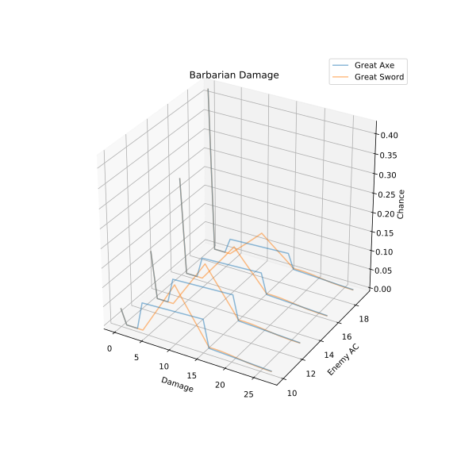

.. _Tutorial:

Tutorial
========

Basic Dice Operations
---------------------

This library tries to keep the operations as intuitive as possible, and
so a lot of the operations were derived from common notation.

Say you're playing D&D and you're playing a barbarian wielding a
Great Axe. Your barbarian's strength bonus is 3, as we just started out.
To calculate the damage of the weapon you'd use :code:`d12 + 3`.

This however requires that we have a :code:`d12` already defined.
Since this is a common scenario there is a builtin method
:meth:`dice_stats.Dice.from_dice` that builds a fair n-sided dice for you.

.. testcode::

    d12 = Dice.from_dice(12)
    print(d12 + 3)

Which correctly outputs:

.. testoutput::

    Dice[1](
       4:  8.3%  1/12
       5:  8.3%  1/12
       6:  8.3%  1/12
       7:  8.3%  1/12
       8:  8.3%  1/12
       9:  8.3%  1/12
      10:  8.3%  1/12
      11:  8.3%  1/12
      12:  8.3%  1/12
      13:  8.3%  1/12
      14:  8.3%  1/12
      15:  8.3%  1/12
    )

This shows that the minimum result is 4 and the maximum is 15. Where all
of the outcomes have the same chance of happening. Which is correct
for the barbarian that we're verifying against.

However if the barbarian were to wield a Great Sword instead then the
damage would instead be :code:`2d6 + 3`. There's two ways to express
this, which both result in the same output.

.. testcode::

    d6 = Dice.from_dice(6)
    print(2*d6 + 3)
    print(d6 + d6 + 3)

.. testoutput::

    Dice[1](
       5:  2.8%  1/36
       6:  5.6%  1/18
       7:  8.3%  1/12
       8: 11.1%  1/9
       9: 13.9%  5/36
      10: 16.7%  1/6
      11: 13.9%  5/36
      12: 11.1%  1/9
      13:  8.3%  1/12
      14:  5.6%  1/18
      15:  2.8%  1/36
    )
    Dice[1](
       5:  2.8%  1/36
       6:  5.6%  1/18
       7:  8.3%  1/12
       8: 11.1%  1/9
       9: 13.9%  5/36
      10: 16.7%  1/6
      11: 13.9%  5/36
      12: 11.1%  1/9
      13:  8.3%  1/12
      14:  5.6%  1/18
      15:  2.8%  1/36
    )

This time the minimum is 5 and the maximum is 15, and both are the same.
This also has a triangular shape to it that the axe didn't.

Rerolling
---------

Lets say we level up our barbarian and give them a point in the fighter
class, with this we give them the Great Weapon Fighting Fighting Style.
This allows us to reroll damage rolls of 1 or 2. But only once per die.

Now that we have this, we want to see how it effects the outcome of the
dice.

.. testcode::

    d6 = Dice.from_dice(6)
    print(2*d6.reroll([1, 2]) + 3)

.. testoutput::

    Dice[1](
       5:  0.3%  1/324
       6:  0.6%  1/162
       7:  2.8%  1/36
       8:  4.9%  4/81
       9:  9.9%  8/81
      10: 14.8%  4/27
      11: 17.3% 14/81
      12: 19.8% 16/81
      13: 14.8%  4/27
      14:  9.9%  8/81
      15:  4.9%  4/81
    )

This, as expected, keeps all the results to be contained within the
5 - 15 range. However we can see a slightly skewed binomial distribution
between the 8 - 15 range.

Whilst the above is preferred when a single reroll is all that happens
to the dice. When you need to perform more actions on the dice then it
can get in the way. However the same functionality can be achieved using
the :meth:`dice_stats.Dice.apply_functions` method.

Since we want to reroll the result if it's a 1 or a 2 then we just need
to return the same as the host dice, however if it's anything else then
we just return what we were given, as those chances don't change.

.. testcode::

    d = (
        Dice.from_dice(6)
            .apply_functions(
                {(1, 2): lambda d: Dice.from_dice(6)},
                lambda d: d,
            )
    )
    print(2*d + 3)

.. testoutput::

    Dice[1](
       5:  0.3%  1/324
       6:  0.6%  1/162
       7:  2.8%  1/36
       8:  4.9%  4/81
       9:  9.9%  8/81
      10: 14.8%  4/27
      11: 17.3% 14/81
      12: 19.8% 16/81
      13: 14.8%  4/27
      14:  9.9%  8/81
      15:  4.9%  4/81
    )

Maximum of two dice
-------------------

Given that barbarians get Reckless Attack at level 2, it means you
get advantage on your attacks which means you roll two d20s to determine
if you beat the opponents AC. To do this you can use the
:meth:`dice_stats.Dice.max` method. Since our barbarian is proficient
in both the Great Sword and the Great Axe we get the proficiency bonus
and we also get an additional 3 due to our strength bonus.

.. testcode::

    print(Dice.from_dice(20).max() + 5)

.. testoutput::

    Dice[1](
       6:  0.2%  1/400
       7:  0.8%  3/400
       8:  1.2%  1/80
       9:  1.8%  7/400
      10:  2.2%  9/400
      11:  2.8% 11/400
      12:  3.2% 13/400
      13:  3.8%  3/80
      14:  4.2% 17/400
      15:  4.8% 19/400
      16:  5.2% 21/400
      17:  5.8% 23/400
      18:  6.2%  1/16
      19:  6.8% 27/400
      20:  7.2% 29/400
      21:  7.8% 31/400
      22:  8.2% 33/400
      23:  8.8%  7/80
      24:  9.2% 37/400
      25:  9.8% 39/400
    )

Tying this all together
-----------------------

Now that you know most of the methods exposed via the
:class:`dice_stats.Dice` class, we can look into how to combine them.

Firstly we should think about the steps involved in determining damage.

1. Determine critical hits and critical misses. Since these go off the
   natural number they should be handled independently of any modifiers.
2. Determine hits and misses.
3. Apply damages to the results.

From here we should then focus on building a function for most steps.
The separation of 1 and 2 improves readability, as otherwise it would
have some complicated logic to handle all the outcomes in one call.
It also means that the code is simpler if any more abilities effect
natural numbers.

.. testcode::

    def _dnd_attack(
        modifier,
        ac,
        damage,
    ):
        def inner(results):
            return (results + modifier).apply_dice(
                {Range.from_range(f'[{ac},]'): damage},
                Dice.from_empty(),
            )
        return inner

    def dnd_attack(
        hit,
        modifier,
        ac,
        damage,
        critical_damage,
    ):
        return hit.apply_functions(
            {
                (1,): lambda _: Dice.from_empty(),
                (20,): lambda _: critical_damage,
            },
            _dnd_attack(modifier, ac, damage)
        )

    # Can pass different stats to reduce duplicate code.
    print(dnd_attack(
        Dice.from_dice(20).max(),
        5,
        10,
        Dice.from_dice(12) + 3,
        2 * Dice.from_dice(12) + 3,
    ))

.. testoutput::

    Dice[1](
       0:  4.0%  1/25
       4:  7.2% 23/320
       5:  7.3% 1393/19200
       6:  7.3% 703/9600
       7:  7.4% 473/6400
       8:  7.5% 179/2400
       9:  7.5% 289/3840
      10:  7.6% 243/3200
      11:  7.7% 1471/19200
      12:  7.7% 371/4800
      13:  7.8% 499/6400
      14:  7.9% 151/1920
      15:  7.9% 1523/19200
      16:  0.8% 13/1600
      17:  0.7% 143/19200
      18:  0.7% 13/1920
      19:  0.6% 39/6400
      20:  0.5% 13/2400
      21:  0.5% 91/19200
      22:  0.4% 13/3200
      23:  0.3% 13/3840
      24:  0.3% 13/4800
      25:  0.2% 13/6400
      26:  0.1% 13/9600
      27:  0.1% 13/19200
    )

Making graphs
-------------

Even though the string representation of a dice is fairly readable,
when you're comparing two options then it starts to become a little less
readable. Due to this the library has added a means to graph the results
on a wire frame plot with relative ease.

To do so you can use matplotlib, which you will need to install from
PyPI. However the result from our function is a collection of numpy
arrays, which means that you should be able to use any numpy compatible
graphing libraries that expose a wire frame plot.

This comes with the downside that all interactions with matplotlib are
handled in your code. However it also gives greater customizability on
how you want the output to be displayed.

.. code-block::

    import mpl_toolkits.mplot3d
    import matplotlib.pyplot as plt

    from dice_stats import display

    results = [
        [
            (
                ac,
                dnd_attack(
                    Dice.from_dice(20).max(),
                    5,
                    ac,
                    Dice.from_dice(12) + 3,
                    2 * Dice.from_dice(12) + 3,
                ),
            )
            for ac in range(10, 20, 3)
        ],
        [
            (
                ac,
                dnd_attack(
                    Dice.from_dice(20).max(),
                    5,
                    ac,
                    2 * Dice.from_dice(6) + 3,
                    4 * Dice.from_dice(6) + 3,
                ),
            )
            for ac in range(10, 20, 3)
        ]
    ]

    fig, ax = plt.subplots(figsize=(10, 10), subplot_kw={'projection': '3d'})

    for result, colour in zip(display.plot_wireframes(results), display.COLOURS):
        ax.plot_wireframe(*result, color=colour, alpha=0.5, cstride=0)

    ax.set_xlabel('Damage')
    ax.set_ylabel('Enemy AC')
    ax.set_zlabel('Chance')
    ax.set_title('Barbarian Damage')
    ax.legend([
        'Great Axe',
        'Great Sword',
    ])

    plt.show()

Which produces the following graph:

This graph shows that both the Great Sword and the Great Axe are very similar,
the difference is whether you want reliable damage, or more random damage.

But most of all it shows that creating fairly complex graphs is fairly
simple.

Next Steps
++++++++++

From here you can play around with :class:`dice_stats.Dice` however you
want. The above shows you how to use the methods to perform simple
operations and doesn't cover all the methods exposed.

The full :ref:`Dice Stats` documentation
